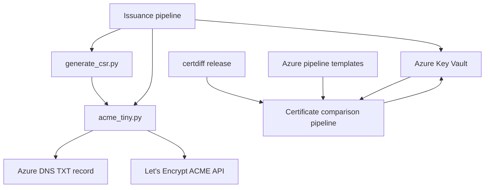

# Architecture

## 1. Purpose

This document describes the current certificate-automation system in this repository: two knowledge
contexts, two Python entrypoints, three Azure DevOps pipelines, and their external service boundaries.

## 2. System overview

Certificate Issuance owns renewal, CSR generation, ACME orders, DNS-01 validation, and import of the
selected certificate into Key Vault. Certificate Comparison owns stable/current comparison,
notification, and promotion. `generate_csr.py` creates the request material consumed by
`acme_tiny.py`. The comparison pipeline consumes certificates written to Key Vault by the issuance
path and also consumes a released `certdiff` wheel and shared Azure pipeline templates.

The pipelines coordinate the flow; the Python files perform request generation and ACME/DNS
operations; Key Vault carries the certificate artifacts across the context boundary.

## 3. Current vs intended architecture

| Area | Current architecture | Intended architecture | Status | Evidence |
| --- | --- | --- | --- | --- |
| Certificate issuance | Azure DevOps invokes the CSR and ACME Python entrypoints. | Not separately documented. | Evidenced | [azure-pipelines.yaml](../azure-pipelines.yaml), [generate_csr.py](../generate_csr.py), [acme_tiny.py](../acme_tiny.py) |
| Certificate comparison | A separate Azure DevOps pipeline compares stable and current chains and selects notification and promotion actions. | Not separately documented. | Evidenced | [azure-pipeline-cert-diff.yaml](../azure-pipeline-cert-diff.yaml) |
| Documentation layout | A context map separates issuance and comparison vocabulary and rules. | Maintain the multi-context layout and repository-wide architecture/ADR records. | Documented | [domain.md](agents/domain.md), [context map](../CONTEXT-MAP.md), [ADR 0001](adr/0001-certificate-automation-domain-set.md) |

No authoritative source documents a future runtime architecture beyond the current pipeline behavior.

## 4. Technology stack

| Area | Technology | Status | Evidence |
| --- | --- | --- | --- |
| Entry points | Python 3.13.9 | Evidenced | [.python-version](../.python-version), [acme_tiny.py](../acme_tiny.py), [generate_csr.py](../generate_csr.py) |
| Certificate and key handling | `cryptography`, `jwcrypto` | Evidenced | [requirements-output.txt](../requirements-output.txt), [acme_tiny.py](../acme_tiny.py), [generate_csr.py](../generate_csr.py) |
| Azure integration | `azure-identity`, `azure-mgmt-dns`, Azure CLI tasks | Evidenced | [requirements-output.txt](../requirements-output.txt), [acme_tiny.py](../acme_tiny.py), [azure-pipelines.yaml](../azure-pipelines.yaml) |
| Automation | Azure DevOps YAML pipelines | Evidenced | [azure-pipelines.yaml](../azure-pipelines.yaml), [azure-pipelines-federated.yaml](../azure-pipelines-federated.yaml), [azure-pipeline-cert-diff.yaml](../azure-pipeline-cert-diff.yaml) |
| Repository quality checks | pre-commit hooks and GitHub workflow validation | Documented | [.pre-commit-config.yaml](../.pre-commit-config.yaml), [_pre-commit.yml](../.github/workflows/_pre-commit.yml), [_pr-title.yml](../.github/workflows/_pr-title.yml) |

## 5. Repository map

| Path | Responsibility | Notes |
| --- | --- | --- |
| `acme_tiny.py` | ACME order, DNS-01 challenge, and certificate-chain retrieval | Requires Azure environment variables and account files. |
| `generate_csr.py` | CSR and private-key generation | The pipeline selects a 2048-bit RSA key. |
| `azure-pipelines.yaml` | Client-secret issuance and Key Vault renewal workflow | Uses Azure service connection and client-secret variables. |
| `azure-pipelines-federated.yaml` | Federated or managed-identity issuance workflow | Uses an identity-type variable and a service connection. |
| `azure-pipeline-cert-diff.yaml` | Stable/current chain comparison and promotion workflow | Downloads Key Vault secrets and can send a notification. |
| `requirements-output.txt` | Hashed issuance dependency set | Installed by issuance CI. |
| `requirements-cert-diff.txt` | Hashed certificate-diff dependency set | Installed by certificate-diff CI. |
| `.github/workflows/` | Repository validation workflows | Covers dependency installation, pre-commit, and PR-title validation. |
| `.github/instructions/` | Copilot review instructions | Evidence-only policy surface; it does not control runtime certificate behavior. |
| `CONTEXT-MAP.md` | Knowledge-context index and relationship | Routes readers to issuance or comparison vocabulary. |
| `docs/domain/` | Context glossaries and normative rules | Separates issuance ownership from comparison ownership. |
| `docs/adr/` | Repository-wide architectural decisions | Records the evidence-derived domain set. |

## 6. Architectural boundaries

- **Pipeline to Python:** downstream. Pipelines supply files, arguments, environment variables, and execution order to the entrypoints. Evidence: [azure-pipelines.yaml](../azure-pipelines.yaml).
- **ACME client to Azure DNS:** downstream. `acme_tiny.py` creates TXT records and later attempts to delete them through the Azure DNS client. Evidence: [acme_tiny.py](../acme_tiny.py).
- **ACME client to Let's Encrypt:** downstream. `acme_tiny.py` sends HTTPS ACME requests to the configured directory and order endpoints. Evidence: [acme_tiny.py](../acme_tiny.py).
- **Pipeline to Key Vault:** downstream. Azure CLI tasks download, import, and update certificate objects or secrets. Evidence: [azure-pipelines.yaml](../azure-pipelines.yaml), [azure-pipeline-cert-diff.yaml](../azure-pipeline-cert-diff.yaml).
- **Certificate Issuance to Certificate Comparison:** downstream. Issuance writes the current certificate; comparison reads current and stable certificates from Key Vault. Evidence: [azure-pipelines.yaml](../azure-pipelines.yaml), [azure-pipeline-cert-diff.yaml](../azure-pipeline-cert-diff.yaml).
- **`certdiff` releases to comparison pipeline:** downstream. The pipeline downloads and verifies a released wheel before use. Evidence: [azure-pipeline-cert-diff.yaml](../azure-pipeline-cert-diff.yaml).
- **Azure pipeline templates to comparison pipeline:** downstream. Mail and availability jobs are imported from `pagopa/azure-pipeline-templates`. Evidence: [azure-pipeline-cert-diff.yaml](../azure-pipeline-cert-diff.yaml).

The Python entrypoints do not define a separate deployable service or persistent repository-local state.

## 7. Dependency rules

### Allowed direction

- Pipelines may coordinate entrypoints and external Azure operations.
- `generate_csr.py` may produce request material consumed by the issuance path.
- `acme_tiny.py` may call the ACME API and Azure DNS because those are its evidenced external effects.
- Certificate Issuance may publish the current certificate through Key Vault for Certificate Comparison.
- Certificate Comparison may read Key Vault artifacts, consume verified `certdiff` releases and
  shared templates, and select notification and promotion actions.

### Avoid / forbidden

- Do not commit account keys, registration data, generated private keys, certificates, or PFX files; the repository ignores the first two file names and pipelines create temporary artifacts. Evidence: [.gitignore](../.gitignore), [azure-pipelines.yaml](../azure-pipelines.yaml).

## 8. Key flows

### Runtime flow

1. The issuance pipeline evaluates force-renewal, certificate presence, and expiry.
2. When issuance is required, it generates a CSR and writes the account files supplied by the pipeline.
3. `acme_tiny.py` creates an ACME order, writes a DNS-01 TXT record, submits the challenge, polls for authorization, and downloads the certificate chain.
4. The pipeline selects the default or requested alternate chain, creates a PFX, imports it into Key Vault, and removes temporary files.

Evidence: [azure-pipelines.yaml](../azure-pipelines.yaml), [azure-pipelines-federated.yaml](../azure-pipelines-federated.yaml), [acme_tiny.py](../acme_tiny.py).

### Build/test flow

1. GitHub Actions selects the Python version from `.python-version`.
2. The build workflow installs each hashed requirements file.
3. The pre-commit workflow runs the pinned hooks in a container.

Evidence: [build-python.yml](../.github/workflows/build-python.yml), [_pre-commit.yml](../.github/workflows/_pre-commit.yml), [.pre-commit-config.yaml](../.pre-commit-config.yaml).

### Deployment/operations flow

1. Azure DevOps runs the selected issuance or comparison pipeline.
2. Issuance writes the selected PFX to Key Vault.
3. Certificate comparison downloads stable and current chains, reports differences, and selects
  notification, promotion, or both when forced renewal is active.
4. Cleanup steps remove temporary files after the job.

Evidence: [azure-pipelines.yaml](../azure-pipelines.yaml), [azure-pipeline-cert-diff.yaml](../azure-pipeline-cert-diff.yaml).

## 9. Configuration and environment

| Configuration | Role | Evidence |
| --- | --- | --- |
| `.python-version` | Selects the Python runtime for local and CI execution. | [.python-version](../.python-version), [build-python.yml](../.github/workflows/build-python.yml) |
| `requirements-output.txt` | Hash-pinned issuance dependencies. | [requirements-output.txt](../requirements-output.txt) |
| `requirements-cert-diff.txt` | Hash-pinned comparison dependencies. | [requirements-cert-diff.txt](../requirements-cert-diff.txt) |
| `CERT_DIFF_VERSION` | Selects the released `certdiff` wheel downloaded and checksum-verified by the comparison pipeline. | [azure-pipeline-cert-diff.yaml](../azure-pipeline-cert-diff.yaml) |
| `AZURE_SUBSCRIPTION_ID`, `AZURE_DNS_ZONE_RESOURCE_GROUP`, `AZURE_DNS_ZONE` | Required by the ACME entrypoint. | [acme_tiny.py](../acme_tiny.py) |
| Azure DevOps variables | Supply Key Vault, certificate, DNS, identity, and notification configuration. | [azure-pipelines.yaml](../azure-pipelines.yaml), [azure-pipeline-cert-diff.yaml](../azure-pipeline-cert-diff.yaml) |

Secret values and live resource identifiers are intentionally not recorded here.

## 10. Testing and validation

| Change type | Suggested validation | Evidence |
| --- | --- | --- |
| Python entrypoint | `python3 -m compileall -q acme_tiny.py generate_csr.py`; run focused tests if added. | [acme_tiny.py](../acme_tiny.py), [generate_csr.py](../generate_csr.py) |
| Pipeline YAML | Run the repository's YAML/pre-commit checks and inspect conditions without live Azure mutation. | [.pre-commit-config.yaml](../.pre-commit-config.yaml), [_pre-commit.yml](../.github/workflows/_pre-commit.yml) |
| Dependency pins | Install the affected requirements file with `--require-hashes`. | [build-python.yml](../.github/workflows/build-python.yml) |
| Documentation | Check Markdown links, anchors, fences, and required sections. | [internal-markdown.instructions.md](../.github/instructions/internal-markdown.instructions.md) |

There is no repository-native test directory or Makefile in the current tracked tree.

## 11. Architectural decisions visible in the repo

### Issuance and comparison contexts

- Decision: Treat certificate issuance and certificate comparison as separate knowledge contexts connected through Key Vault certificate artifacts.
- Status: Accepted through the approved execution plan.
- Evidence: [context map](../CONTEXT-MAP.md), [issuance pipeline](../azure-pipelines.yaml), [comparison pipeline](../azure-pipeline-cert-diff.yaml).
- Trade-off: Separate glossaries and rules make ownership explicit, at the cost of maintaining one context relationship and two domain document sets.
- Related ADR: [0001-certificate-automation-domain-set](adr/0001-certificate-automation-domain-set.md).

### Hashed dependency installation

- Decision: CI installs both dependency sets with hash verification.
- Status: Evidenced; no ADR is present.
- Evidence: [build-python.yml](../.github/workflows/build-python.yml), [azure-pipelines.yaml](../azure-pipelines.yaml), [azure-pipeline-cert-diff.yaml](../azure-pipeline-cert-diff.yaml).
- Trade-off: Reproducibility and integrity checks require maintaining complete lock hashes.

## 12. AI-agent working rules

- Read this document before structural changes.
- Preserve existing repository patterns and boundaries.
- Keep changes scoped to the requested component and update this document when an intentional architectural change occurs.
- Report conflicts between this document and on-disk evidence before editing.
- Prefer existing repository patterns over new abstractions.
- Do not introduce new frameworks or cross-cutting refactors without explicit approval.

## 13. Last verified

- Verification date: 2026-09-01.
- Agent or tool: `/internal-knowledge bootstrap`, with repository-local inspection.
- Files inspected: root instructions, domain guidance, README, Python entrypoints, three Azure DevOps pipelines, both dependency lock files, pre-commit configuration, and all GitHub Actions workflows.
- Commands considered or run: Git status and tracked-file inventory; Markdown, local-link, anchor,
  scope, pre-commit, and `git diff --check` validation; Mermaid render validation with the integrated
  renderer. No local Mermaid CLI is installed.
- Confidence: High for the checked-in flow and documentation topology; live Azure permissions, variable values, remote templates, and pipeline execution were not verified.

## 14. Unknown / To verify

- The exact Azure subscriptions, resource groups, DNS zones, Key Vaults, and service connections are supplied at runtime and are not evidenced as fixed repository resources.
- The ownership and approval process for production certificate changes is not stated in the repository.
- No automated unit or integration tests for ACME, DNS, certificate comparison, or Key Vault behavior are present in the tracked tree.
- The source of the README's auto-generated block is not identified on disk; its `build e test` label is broader than the dependency-install behavior in `build-python.yml`.
